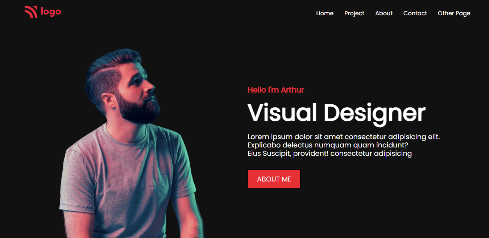
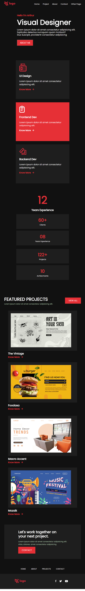

# Assignment - 15

## Project 15 [Live Link](https://full-stack-js-projects-15.netlify.app/)

- ### skills used in project
  - Learn CSS Position, Grid, flexbox etc.
  - Learn Responsive design using media quries.
  - Total time taken 9hr to complete.
## Screenshot
### Desktop

### Mobile Responsive

